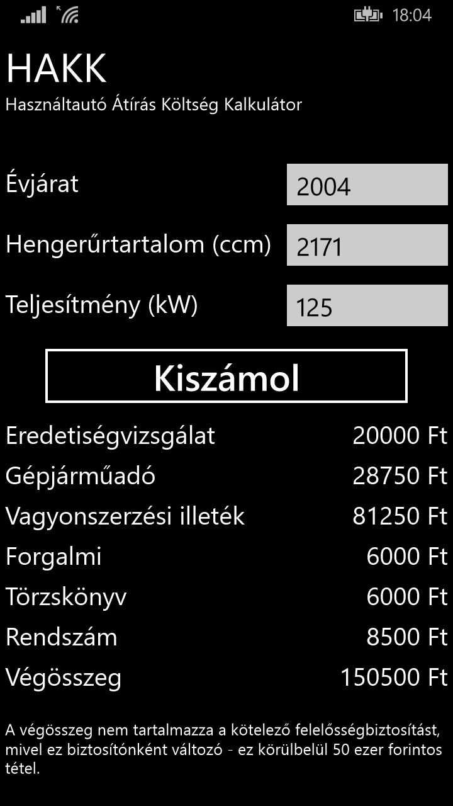
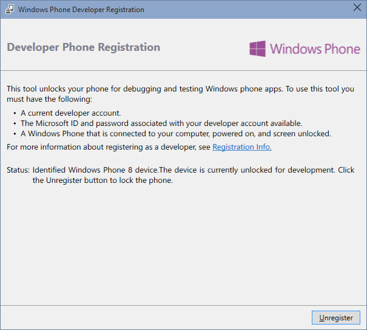
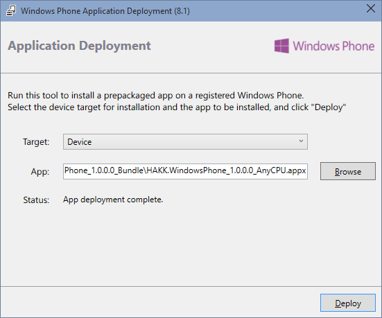

# hakk
Használtautó Átírás Költség Kalkulátor

## Használat

Magától értetődő. Töltsük ki a 3 beviteli mezőt, majd nyomjunk a **Kiszámol** gombra.

## Telepítés

Sajnos a Store-ba feltöltés pénzbe kerül, így a telepítést onnan nem lehet elvégezni. Helyette a [Visual Studio](https://www.visualstudio.com/en-us/downloads/download-visual-studio-vs.aspx)-t kell telepíteni a Windows Phone komponensekkel.

Ha ez kész, a **Windows Phone Developer Registration** programmal engedélyezhetjük az .appx programok telepítését a telefonunkon.

Ezután a **Windows Phone Application Deployment** programmal tudjuk telepíteni a HAKK .appx fájlját.

